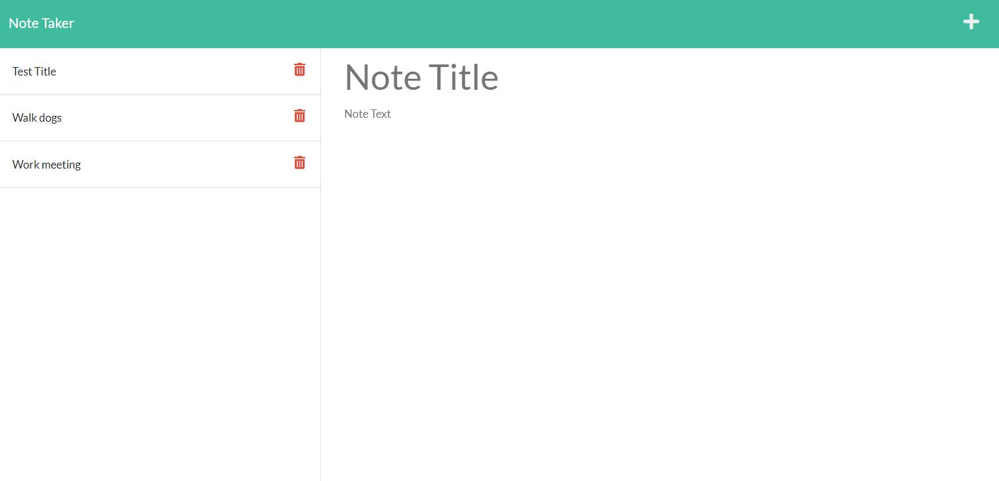

# 11 Express.js: Note Taker

## Description

The motivation of this project is to build a full stack application that can be used to write and save notes. The focus of this project is to use an Express.js back end to save and retrieve note data from a JSON file. The application is powered by node.js, npm, and express.js to run the back end of the application. The server code is used to register routes with HTTP requests to serve static assets and accept/store JSON payloads from the client side using the fetch command. It also includes middleware to be able to parse incoming request bodies and url encoded payloads from the front end and define a specific root in the directory. These functionalities allow the user data to be persisted in the server. The full application is deployed to Heroku and conforms to REST.

## Installation

The following tools were used for the development and testing of this project. Web Browser (Google Chrome preferred) Code development IDE (Microsoft VS Code) node.js (JavaScript runtime environment) npm (software registry containing express) Insomnia (REST API).

## Usage

Open command line interface and run node commands to initiate the command-line application. Open HTML using Code development IDE. 

## Credits

Georgia Tech Coding Bootcamp instructors, TA's, and other faculty.

## License

Not applicable

## Tests
The Insomnia tool is used to test back end HTTP Requests.
